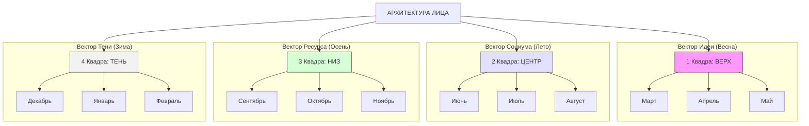

# Галерея типов: Архитектурные морфы (Сезоны)

В данном разделе представлены «эталонные» портреты для каждого из 12 типов. Каждое изображение — это морфинг реальных представителей типа, созданный для выявления устойчивых антропологических доминант.

## 🗺️ Карта соответствия: Лицо — Тело — Сезон

Ниже приведена иерархия распределения векторов развития согласно архитектуре лица и календарному циклу.

---

## 🌸 Весна: 1 Квадра (ВЕРХ)
> **Вектор Идеи:** Голова / Интеллект

| Месяц | Основной Морф | Доминанты |
| :--- | :---: | :--- |
| **Март** |  | Высокая переносица, акцент на надбровных дугах. |
| **Апрель** | | Широкий лоб, открытая архитектура. |
| **Май** |  | Плотность тканей лба, ментальная концентрация. |

## ☀️ Лето: 2 Квадра (ЦЕНТР)
> **Вектор Социума:** Грудная клетка / Руки

| Месяц | Основной Морф | Доминанты |
| :--- | :---: | :--- |
| **Июнь** |  | Выраженные скулы, активная мимика. |
| **Июль** |  | Широкая посадка глаз, контактность. |
| **Август** |  | Очерченный нос, вектор захвата пространства. |

## 🍂 Осень: 3 Квадра (НИЗ)
> **Вектор Ресурса:** Живот / Гениталии

| Месяц | Основной Морф | Доминанты |
| :--- | :---: | :--- |
| **Сентябрь** |  | Тяжелая челюсть, устойчивость, опора на инстинкты. |
| **Октябрь** |  | Плотность губ, фиксация на результате. |
| **Ноябрь** |  | Пробивная мощь нижней трети, захват ресурса. |

## ❄️ Зима: 4 Квадра (ТЕНЬ)
> **Вектор Тени:** Ступни / Шпионаж

| Месяц | Основной Морф | Доминанты |
| :--- | :---: | :--- |
| **Декабрь** |  | Мягкость контуров, глубинная интуиция. |
| **Январь** |  | Эффект маски, архитектура как броня. |
| **Февраль** |  | Адаптивность, размытость, мимикрия. |

