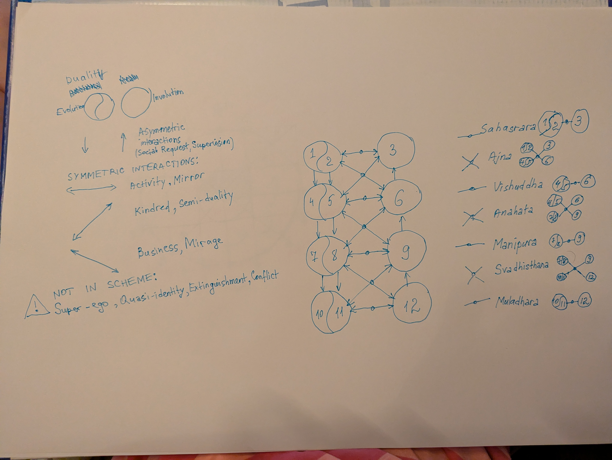
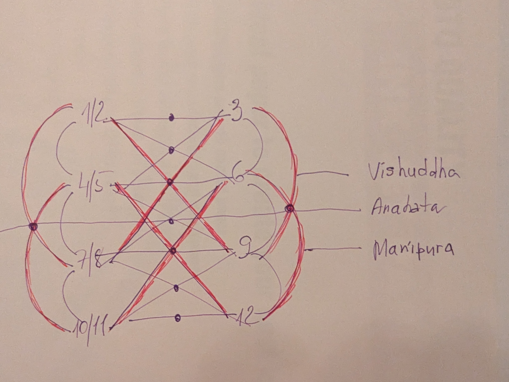
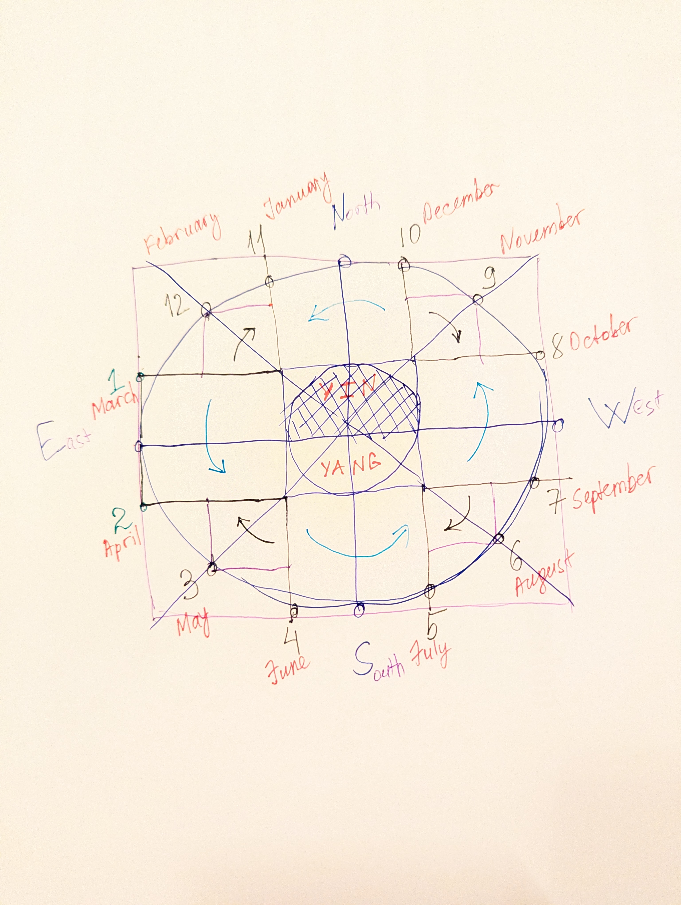

# Seasonal Thinking Typology: Matrix of Human Cognition

*Рис. 1: Карта интертипных отношений, спиралей и чакральных соответствий.* 

 ---

 
*Рис. 2: Карта конфликтных интертипных отношений, спиралей и чакральных соответствий.* 

 ---

 
*Рис. 3: Движение спиралей во времени и пространстве.* 

 ---
 
This system describes the relationship between nature cycles, socionic progress rings, and brain hemisphere function.

## 🌀 1. Spiral Direction Rule
*Fundamental movement for all Seasons:*

### Right Spiral (Evolution)
- **Attributes:** Right Spiral, Evolution, Yang, Rational.
- **Brain:** Left Brain Hemisphere.
- **Houses:** 1(+2) → 4(+5) → 7(+8) → 10(+11).
- **Thinking:** Linear + Dialectical (Vertical strategy, bottom-top).
- **Socionics:** Right Ring of Social Progress.

### Left Spiral (Involution)
- **Attributes:** Left Spiral, Involution, Yin, Irrational.
- **Brain:** Right Brain Hemisphere.
- **Houses:** 3 → 6 → 9 → 12.
- **Thinking:** Vortex + 3D (Horizontal strategy, periphery-center).
- **Socionics:** Left Ring of Social Progress.

---

## ☯️ 2. YIN/YANG Core Rules

### Energy Distribution
- **YIN Seasons:** Autumn, Winter.
- **YANG Seasons:** Spring, Summer.

### Temperamental Patterns
- **YIN Months (Irrational):** 1(+2), 6, 7(+8), 12.
  - *Pattern:* Sanguine + Melancholic.
- **YANG Months (Rational):** 3, 4(+5), 9, 10(+11).
  - *Pattern:* Choleric + Phlegmatic.

---

## 🌦 3. Seasonal Breakdown

### 🌱 SPRING (East | Alpha | Child | Morning)
*Color: Warm Contrast RGB | Energy: YANG*
*   **Transition:** 1(+2) → 3
*   **March/April:** 1st/2nd House (Aries/Taurus) | Linear/Dialectic | Right Spiral.
*   **May:** 3rd House (Gemini) | Vortex + 3D | Left Spiral.
*   **Features:** Peripherality, Individualism, Democratism, Anarchy, Family-Cognitive values.

### ☀️ SUMMER (South | Beta | Youngster | Day)
*Color: Cold Muted RGB | Energy: YANG*
*   **Transition:** 4(+5) → 6
*   **June/July:** 4th/5th House (Cancer/Leo) | Dialectic/Linear | Right Spiral.
*   **August:** 6th House (Virgo) | Vortex + 3D | Left Spiral.
*   **Features:** Centrality, Collectivism, Aristocratism, Unitarity, Romantic-Strength values.

### 🍂 AUTUMN (West | Gamma | Adult | Evening)
*Color: Warm Muted RGB | Energy: YIN*
*   **Transition:** 7+8 → 9
*   **Sept/Oct:** 7th/8th House (Libra/Scorpio) | Linear/Dialectic | Right Spiral.
*   **November:** 9th House (Sagittarius) | Vortex + 3D | Left Spiral.
*   **Features:** Centrality, Individualism, Democratism, Federation, Liberal-Pragmatic values.

### ❄️ WINTER (North | Delta | Elderly | Night)
*Color: Cold Contrast RGB | Energy: YIN*
*   **Transition:** 10+11 → 12
*   **Dec/Jan:** 10th/11th House (Capricorn/Aquarius) | Dialectic/Linear | Right Spiral.
*   **February:** 12th House (Pisces) | Vortex + 3D | Left Spiral.
*   **Features:** Peripherality, Collectivism, Aristocratism, Confederation, Humanitarian-Diligent values.

---

### 📊 Сводная таблица типологии

| Сезон | Энергия | Квадра | Спираль (Evolution) | Спираль (Involution) | Ценности |
| :--- | :---: | :---: | :--- | :--- | :--- |
| **Весна** | YANG | Альфа | Правая: 1(+2) дом | Левая: 3 дом | Анархия, Семья |
| **Лето** | YANG | Бета | Правая: 4(+5) дом | Левая: 6 дом | Унитаризм, Сила |
| **Осень** | YIN | Гамма | Правая: 7(+8) дом | Левая: 9 дом | Федерация, Прагматизм |
| **Зима** | YIN | Дельта | Правая: 10(+11) дом | Левая: 12 дом | Конфедерация, Гуманизм |

---

# Seasonal Thinking Typology & Matrix of Cognition

Система описывает взаимосвязь природных циклов, цветовых архетипов (основание-Color Seasonal Analysis) и соционических колец прогресса.

## 📊 Матрица соответствий

| Сезон | Дом | Цветотип | Темперамент | Мышление | Спираль |
| :--- | :---: | :--- | :--- | :--- | :--- |
| **ВЕСНА** | 1 (+2) | Bright (Clear)/Warm (True) Spring | Sanguine + Melancholic | Linear + Dialectic | Правая (Yang) |
| (Альфа) | 3 | Light Spring | Choleric + Flegmatic | **Vortex + 3D** | Левая (Yin) |
| **ЛЕТО** | 4 (+5) | Light /Cool (True) Summer | Choleric + Flegmatic | Dialectic + Linear | Правая (Yang) |
| (Бета) | 6 | Soft Summer | Sanguine + Melancholic | **Vortex + 3D** | Левая (Yin) |
| **ОСЕНЬ** | 7 (+8) | Soft/Warm (True) Autumn | Sanguine + Melancholic | Linear + Dialectic | Правая (Yang) |
| (Гамма) | 9 | Dark (Deep) Autumn | Choleric + Flegmatic | **Vortex + 3D** | Левая (Yin) |
| **ЗИМА** | 10 (+11) | Dark(Deep) Winter/Cool (True) Winter | Choleric + Flegmatic | Dialectic + Linear | Правая (Yang) |
| (Дельта) | 12 | Bright (Clear) Winter | Sanguine + Melancholic | **Vortex + 3D** | Левая (Yin) |

---

## 🧠 Ключевые механизмы

### Пример: 6-й Дом (Жуков + Есенин)
Комбинация **Sanguine + Melancholic** (Гибко-разворотливый + Восприимчиво-адаптивный по Гуленко) создает уникальный паттерн:
*   **Vortex:** Сангвиническая энергия закручивает вихрь.
*   **3D:** Меланхолическая чувствительность позволяет "принимать форму" и видеть объем.
*   *Результат:* Иррациональная левая спираль (Инволюция).

### Правила Спиралей:
1.  **Правая (Evolution):** Левое полушарие, Ян, рациональность, вертикальная стратегия (bottom-top).
2.  **Левая (Involution):** Правое полушарие, Инь, иррациональность, горизонтальная стратегия (periphery-center).

---

### 🪐 Матрица Синтеза: Септенер + Восточный цикл
"Точка отсчета восточного цикла — Дракон (1-й дом), как символ первичного импульса" 
*Классическая система управления без высших планет* Используется система Септенера: управление знаками Скорпион (Марс), Водолей (Сатурн) и Рыбы (Юпитер) возвращено к классическим управителям для чистоты архетипов

| Сезон | Дом | Планета (Септенер) | Животное (Китай) | Спираль | Мышление |
| :--- | :---: | :--- | :--- | :--- | :--- |
| **ВЕСНА** | 1 (+2) | Марс (Венера) | **Дракон** (Змея) | Правая | Linear/Dialectic |
| | 3 | Меркурий | **Лошадь** | **Левая** | **Vortex + 3D** |
| **ЛЕТО** | 4 (+5) | Луна (Солнце) | **Коза** (Обезьяна) | Правая | Dialectic/Linear |
| | 6 | Меркурий | **Петух** | **Левая** | **Vortex + 3D** |
| **ОСЕНЬ** | 7 (+8) | Венера (Марс) | **Собака** (Свинья) | Правая | Linear/Dialectic |
| | 9 | Юпитер | **Крыса** | **Левая** | **Vortex + 3D** |
| **ЗИМА** | 10 (+11)| Сатурн (Сатурн) | **Бык** (Тигр) | Правая | Dialectic/Linear |
| | 12 | Юпитер | **Кролик** | **Левая** | **Vortex + 3D** 

---

### 👤 Справочник типов: Соционика & MBTI (International Standard)

| Дом | Соционический тип (RU) | MBTI (International) | Псевдоним | Характер мышления |
| :--- | :--- | :---: | :--- | :--- |
| **1** | Дон Кихот | **ENTP** | Искатель | Линейное (Evolution) |
| **2** | Дюма | **ISFP** | Посредник | Диалектическое |
| **3** | Робеспьер + Гюго | **INTJ + ESFJ** | Аналитик + Энтузиаст | **Vortex + 3d (Involution)** |
| **4** | Гамлет | **ENFJ** | Наставник | Диалектическое (Evolution) |
| **5** | Максим Горький | **ISTJ** | Инспектор | Линейное |
| **6** | Жуков + Есенин | **ESTP + INFP** | Маршал + Лирик | **Vortex + 3d (Involution)** |
| **7** | Наполеон | **ESFP** | Политик | Линейное (Evolution) |
| **8** | Бальзак | **INTP** | Критик | Диалектическое |
| **9** | Джек + Драйзер | **ENTJ + ISFJ** | Предприниматель + Хранитель | **Vortex + 3d (Involution)** |
| **10** | Штирлиц | **ESTJ** | Администратор | Диалектическое (Evolution) |
| **11** | Достоевский | **INFJ** | Гуманист | Линейное |
| **12** | Гексли + Габен | **ENFP + ISTP** | Советчик + Мастер | **Vortex + 3d (Involution)** |

---

## 📖 Legend & Lore (Мифология Циклов)

### 🌱 Весна: Пробуждение Дракона (1+2 → 3)
Весна начинается с чиха **Мартовского Дракона (1 дом, Марс)**. Этот импульс — чистый Ян, взрывающий мерзлоту. Пока **Венера (2 дом)** нежно укореняет первые ростки, создавая уют, **Меркурианская Лошадь (3 дом)** уже закручивает первый вихрь (Vortex). Она несется по полям, смешивая запахи и смыслы, превращая статику земли в хаос возможностей.

### ☀️ Лето: Драма Светил и Двойняшки (4+5 → 6)
Лето — это королевский двор. **Лунный Гамлет (4 дом)** приносит эмоциональный надрыв и влажную жару, а **Солнечный Максим (5 дом)** — стальной полдень и закон. Их союз порождает **Меркурианских Двойняшек (6 дом: Жуков + Есенин)**. Эти дети — истинный Vortex: один пробивает стены, другой затекает в щели. Они дробят монолит родительского порядка, создавая вихрь, в котором сгорает лето.

### 🍂 Осень: Золотой Бал и Тайный Подвал (7+8 → 9)
**Венера (7 дом)** — Хозяйка Золотого Бала, она делит урожай по справедливости и танцует в свете закатного солнца. Но в тени стоит **Марс-Плутон (8 дом)**. Он — Хранитель Подземелий. Пока наверху празднуют, он проверяет запасы и отсекает мертвое от живого. Их спор разрешает **Юпитерианская Крыса (9 дом)**. Она закручивает прагматичный вихрь, превращая красоту и тайны в торговые стратегии и масштабные планы. «Мораль Крысы — это не изящество слов, а строгость договора. Она верит не в ритуалы, а в результат, принося с собой дух протестантского прагматизма, где успех — это высшая добродетель. В этом вечном цикле Дракон (1 дом) дарует импульс бытия, но добровольно уступает первенство Крысе (9 дом). Мораль их союза проста: Творец создает мир, а Прагматик учит этот мир двигаться. Дракон — это огонь начала, Крыса — это разум, оседлавший этот огонь.

### ❄️ Зима: Стариковское Чаепитие (10+11 → 12)
Зима — это покой двух патриархов. **Сатурн (10, 11)** строит ледяные стены этики и закона, удерживая мир от распада. К нему в гости приходит **Юпитер (12)** — старый Странник в облике **Гексли и Габена**. Его вихрь — это не разрушение, а растворение границ перед лицом Вечности. Они вместе пьют чай, глядя, как снег заметает тропы, зная, что в глубине уже зреет новый Дракон.

--- 

## 🧠 Аналитические заметки 
** Полевое наблюдение **  Пример интуитивного самоопределения типа Дон Кихот (1 дом): 'A rat with a flight of a dragon'. Здесь субъект объединяет прагматизм 9-го дома (Крыса) с первозданным масштабом 1-го дома (Дракон), подтверждая фрактальную связь начала и середины цикла.

---

## 📚 Библиография и источники

Данная типология базируется на синтезе классических систем и развитии идей Гуманитарной Соционики:

1. **В. В. Гуленко** — «Гуманитарная соционика». Концепция Колец социального прогресса (Правая и Левая спирали), формы мышления (Причинно-следственное/Linear, Диалектико-алгоритмическое, Вихревое/Vortex, Голографическое/3d).
2. **В. В. Гуленко** — Функциональная соционика и энергетическая модель (DCNU).
3. **Классическая Астрология** — Система Септенера и концепция управления Домами.
4. **C.G. Jung** — Психологические архетипы.

*Примечание: В рамках данного архива идеи Гуленко адаптированы под 12-домную сезонную матрицу и фрактальную модель Инь-Ян.*
